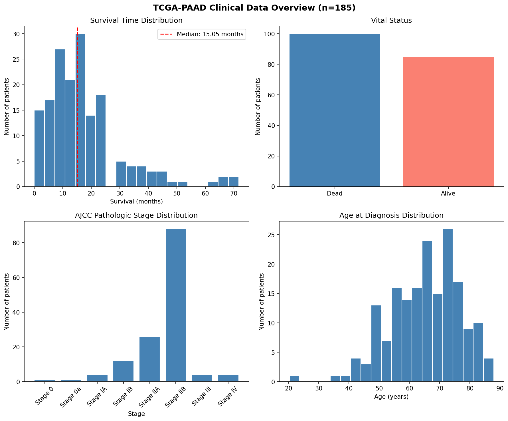
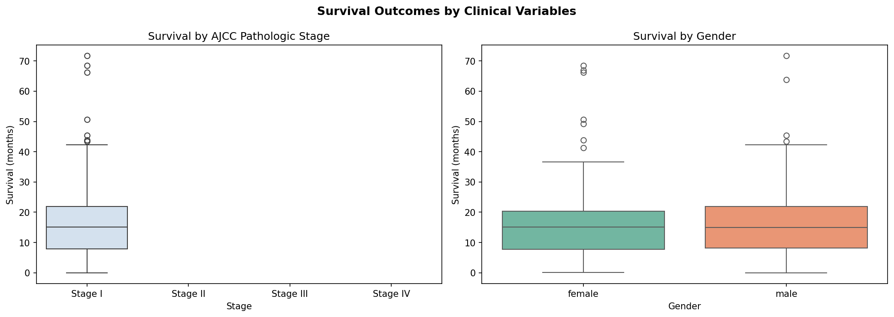
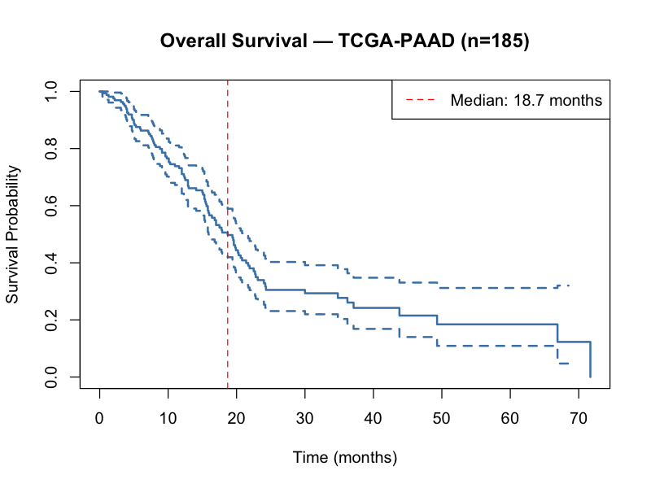
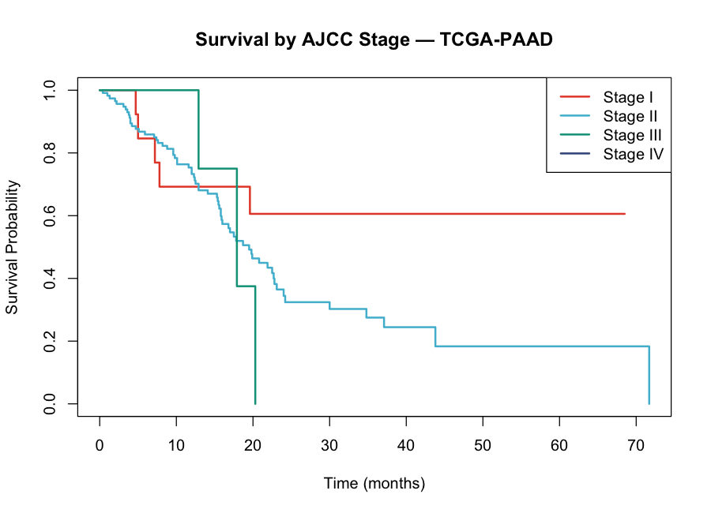
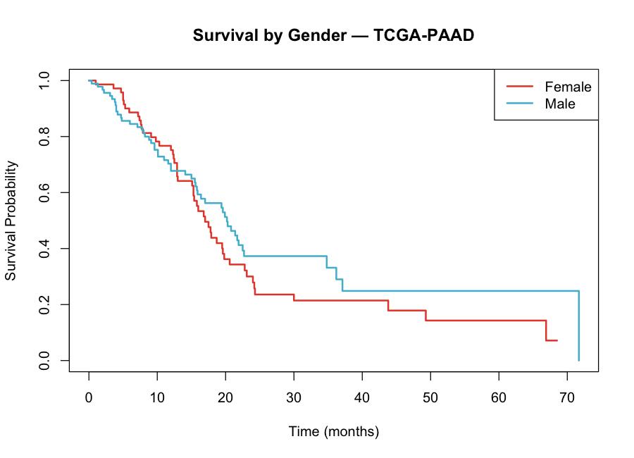
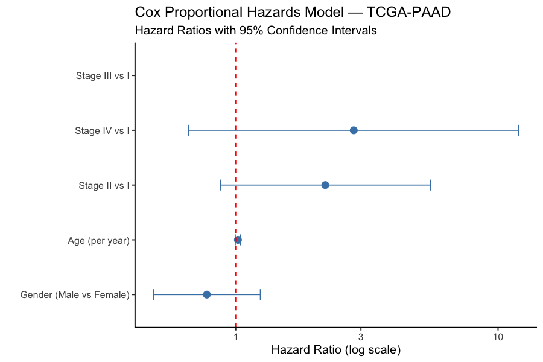

# tcga-paad-survival-analysis
Survival analysis and clinical data exploration of pancreatic ductal adenocarcinoma using TCGA-PAAD
# TCGA-PAAD Survival Analysis

## Overview
Clinical data analysis and survival modeling of pancreatic ductal adenocarcinoma 
(PDAC) using The Cancer Genome Atlas (TCGA-PAAD) dataset. This project explores 
how clinical variables — including tumor stage, age, and gender — relate to 
patient survival outcomes.

## Objectives
- Clean and preprocess raw TCGA clinical data using Python (pandas)
- Perform Kaplan-Meier survival analysis stratified by key clinical variables
- Fit Cox proportional hazards models to identify prognostic factors
- Visualize survival curves and clinical variable distributions

## Data Source
Data downloaded from the NCI Genomic Data Commons (GDC):  
[TCGA-PAAD Project](https://portal.gdc.cancer.gov/projects/TCGA-PAAD)  
n = 185 patients with pancreatic ductal adenocarcinoma

## Tools & Languages
- **Python** — pandas, matplotlib, seaborn (data cleaning & EDA)
- **R** — survival, ggplot2, tidyverse (survival analysis & visualization)

## Repository Structure
- `notebooks/` — Python Jupyter notebook for data cleaning and EDA
- `scripts/` — R scripts for survival analysis, numbered in order
- `results/figures/` — all generated plots

## Results

### Clinical Data Overview

### Survival by Clinical Variables

### Overall Survival

### Survival by AJCC Stage

### Survival by Gender

### Cox Proportional Hazards Model

## Key Findings

**Median overall survival was 18.7 months** across 185 TCGA-PAAD patients,
consistent with published PDAC survival estimates.

**Stage distribution was heavily skewed toward Stage IIB**, reflecting that
most PDAC patients are diagnosed at locally advanced stages.

**Cox regression identified higher tumor stage as associated with increased
hazard**, though wide confidence intervals reflect the small sample size per
stage group — particularly Stage III (n=4) and Stage IV (n=4).

**Gender and age were not independently associated with survival** in this
cohort after adjusting for stage, consistent with existing PDAC literature.

## Clinical Context
Pancreatic ductal adenocarcinoma has one of the poorest prognoses of any
cancer type. This analysis confirms the expected survival patterns in the
TCGA-PAAD cohort and demonstrates a reproducible pipeline for clinical
survival analysis using publicly available data.

## Author
Simran Randhawa | MS Student, Johns Hopkins Bloomberg School of Public Health  
[LinkedIn](your-linkedin-url)
